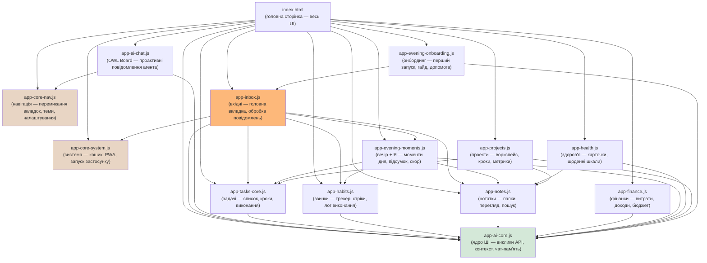
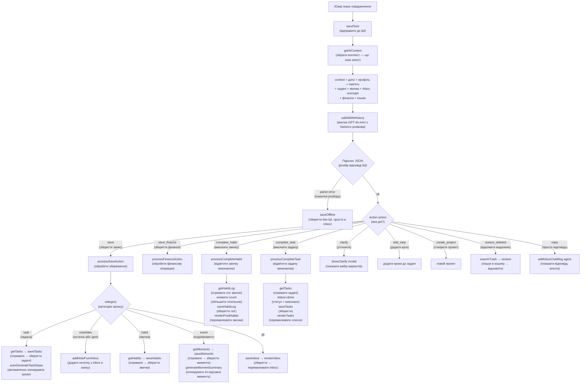
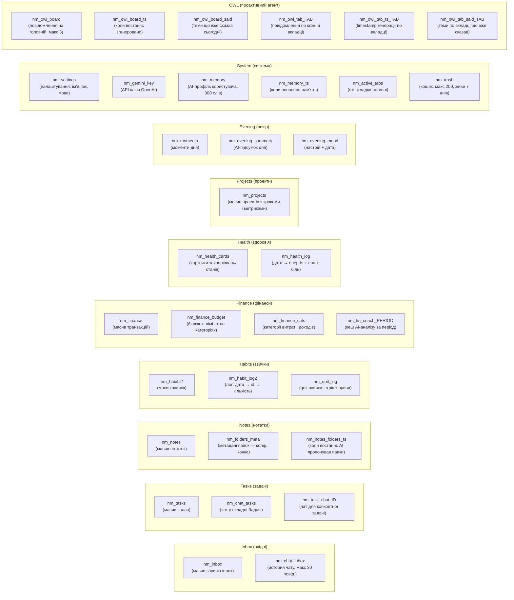
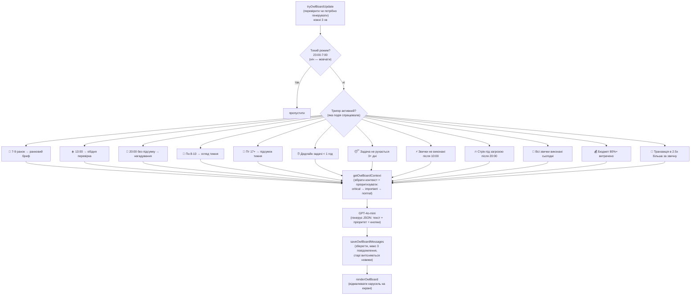
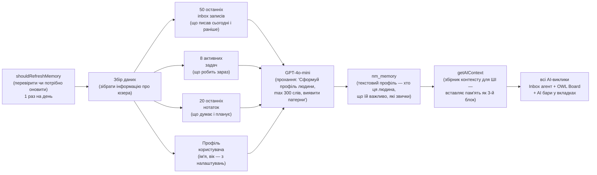
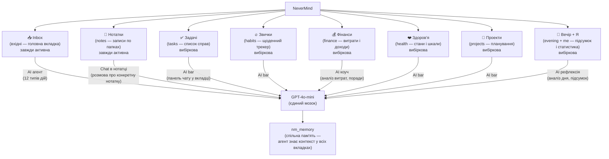

# NeverMind — Архітектура системи

## 1. Граф модулів (хто від кого залежить)

---

## 2. Flow: Юзер пише в Inbox

---

## 3. Карта даних (localStorage)

> **localStorage** — це вбудоване сховище браузера. Як таблиця: ключ → значення. Всі дані застосунку тут.

---

## 4. OWL Board — тригери проактивних повідомлень

---

## 5. Пам'ять агента (Memory System)

---

## 6. Вкладки та їх можливості

