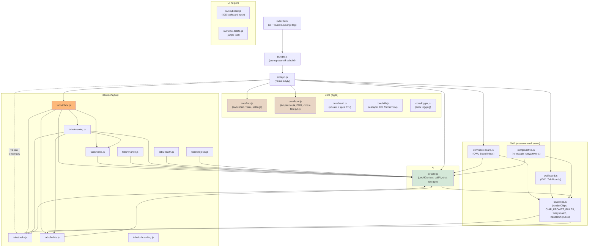
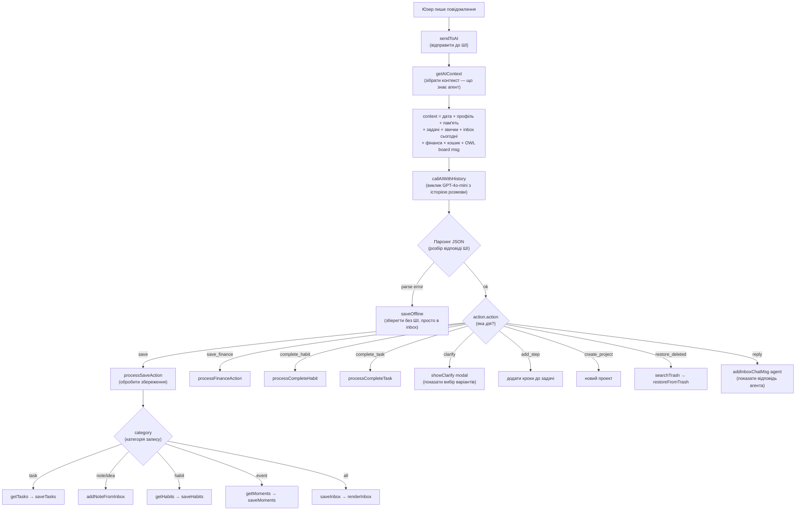
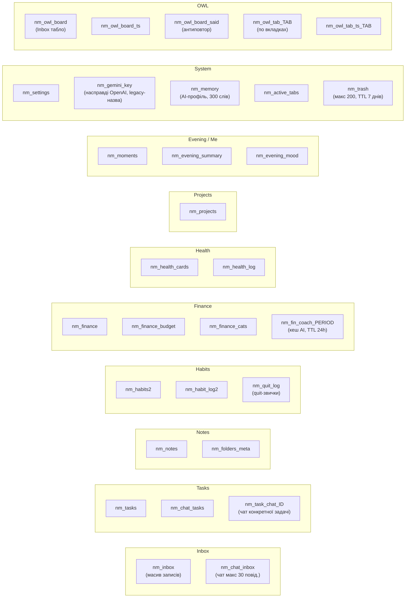
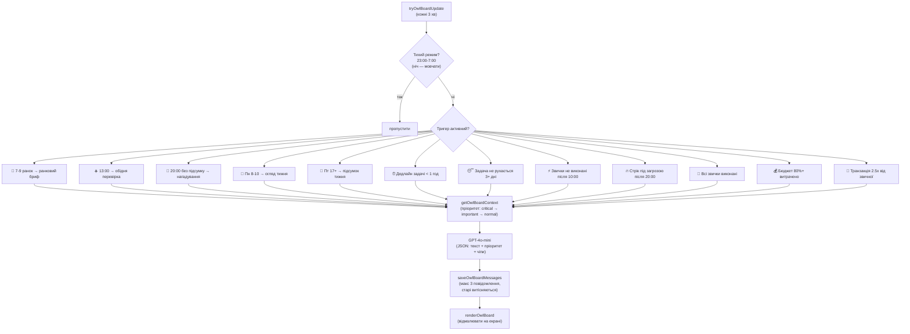
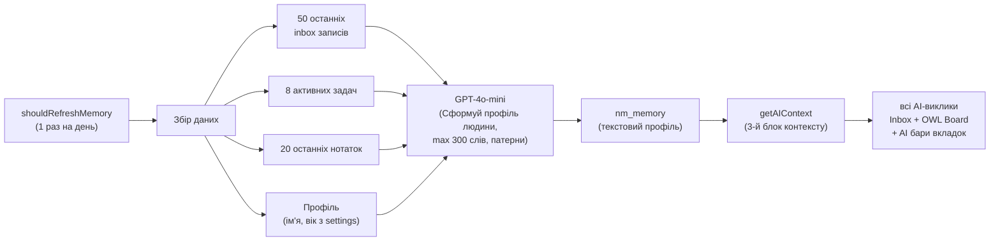
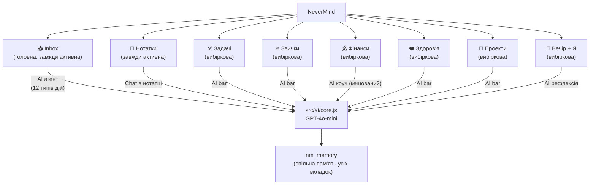

# NeverMind — Архітектура системи

> **Де що шукати:** повна таблиця файлів з відповідальністю → `CLAUDE.md` секція "Файлова структура".
> Цей файл містить **діаграми потоків** (data flow, triggers, memory) які доповнюють текстовий опис.

---

## 1. Граф модулів (збірка)

Проект використовує **ES Modules** з бандлером `esbuild`. Вхідна точка `src/app.js` імпортує всі модулі у правильному порядку (критично для сумісності з iOS). Бандлер генерує `bundle.js` який підключається одним `<script>` тегом в `index.html`.

**Ключове:** `src/ai/core.js` — єдиний мозок. Всі AI-виклики проходять через нього. Кожна вкладка має свій AI bar який викликає `callAI()` з відповідним контекстом з `getAIContext()`.

---

## 2. Flow: Юзер пише в Inbox

---

## 3. Карта даних (localStorage)

> **localStorage** — вбудоване сховище браузера. Ключ → значення. Всі дані застосунку тут.

**Повна таблиця ключів з модулями** → `CLAUDE.md` секція "Дані (localStorage)".

---

## 4. OWL Board — тригери проактивних повідомлень

**Релевантні файли:** `src/owl/proactive.js` (тригери і генерація), `src/owl/inbox-board.js` (Inbox табло), `src/owl/board.js` (Tab boards).

---

## 5. Пам'ять агента (Memory System)

**Модуль:** `src/ai/core.js` — функції `getAIContext()`, `shouldRefreshMemory()`, `buildMemoryProfile()`.

---

## 6. Вкладки та AI-інтеграція

**Ключовий принцип:** єдиний мозок. Кожна вкладка бачить той самий контекст через `getAIContext()`. Агент не плутається між вкладками — пам'ятає що користувач робив у Фінансах коли пише у Задачі.

---

## Важливі технічні нюанси (чому так зроблено)

- **AI бари поза `.page` div** — `position:fixed` всередині `transform` не працює на iOS Safari
- **`safeAgentReply`** — завжди замість прямого `addMsg('agent', reply)` — перевіряє чи не сирий JSON
- **Вечір не копіює дані** — читає напряму з `nm_notes` і `nm_moments` при рендері (правило: "Копіювати дані між storage — заборонено")
- **SW кеш (`CACHE_NAME`)** — ім'я `nm-YYYYMMDD-HHMM` оновлюється вручну перед пушем. CI **не** чіпає `sw.js`. Правило з `CLAUDE.md`.
- **Порядок імпортів у `src/app.js`** — критичний, повторює порядок старих `<script>` тегів для уникнення циклічних залежностей

---

> Архів старої версії цього файлу (з описом флат-структури `app-*.js` до ES-modules рефакторингу) → `_archive/NEVERMIND_ARCH.md`.
